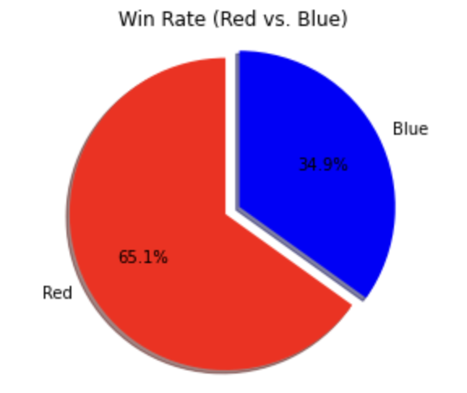
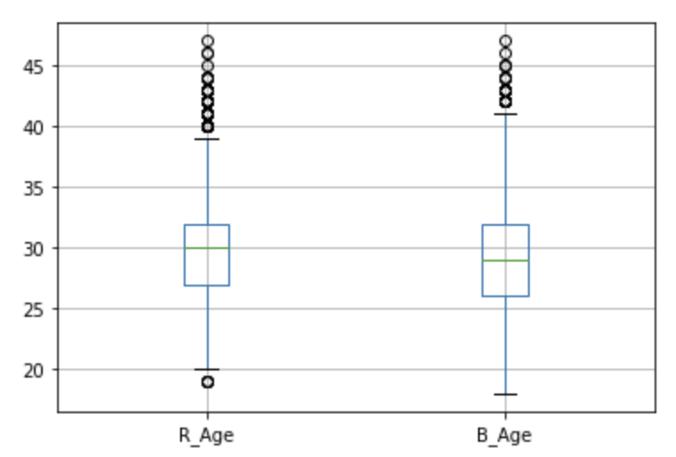
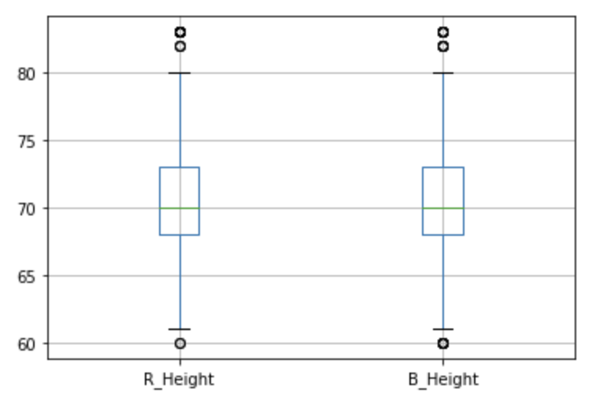
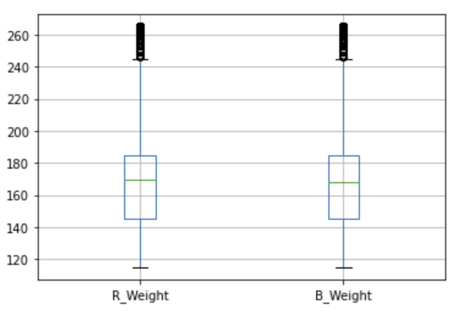
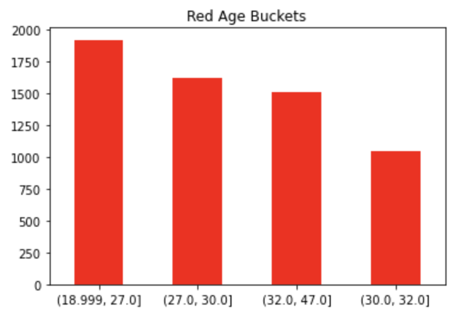
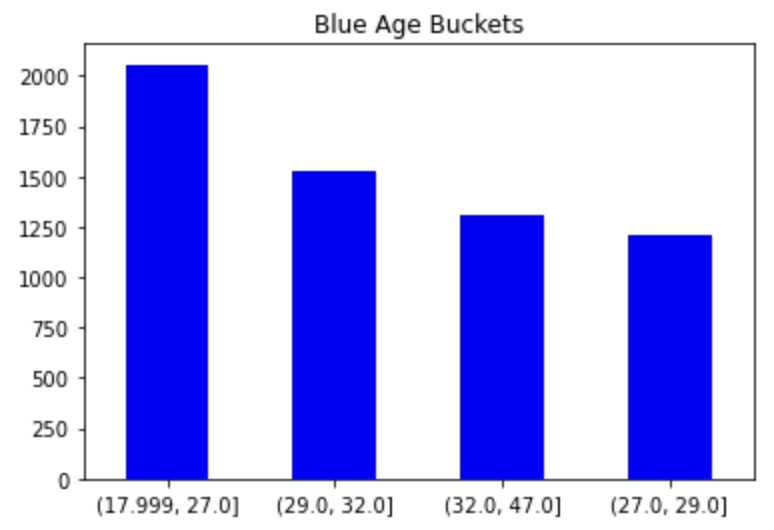
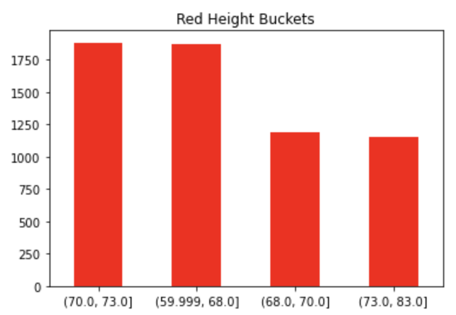
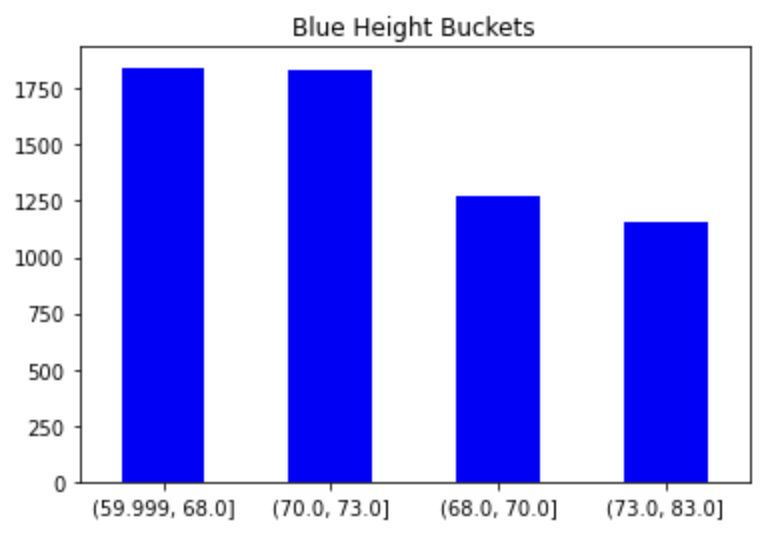
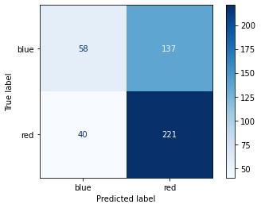

# UFC Fight Analysis

## Project Overview

### Selected topic
<!--Need to change "from 2013" to reflect the date range in the scraped data-->
The topic selected by the team was UFC Fight Analysis of all UFC fights from 2013.

### Reason topic was selected
The team selected to analyze UFC fights from 2013 because the team members had prior interest in UFC fighting, and were intrigued by the data contained in the dataset.

### Description of the source of data
The data on UFC fights from 2013 was obtained from [Kaggle](https://www.kaggle.com/calmdownkarm/ufcdataset?select=data.csv).

### Questions the team hopes to answer with the data
The questions we hope to answer with the data include:

-   Can our machine learning model predict the `winner` (target) based on the features?
-   Can our machine learning model predict the `winby` based on features?
-   Is there a relationship between fighter `age` and `winner` outcome?
-   Is there a relationship between fighter `height` and `winner` outcome?
-   Is there a relationship between fighter `hometown` and `winner` outcome?
-   Is there a relationship between fighter `weight` and `winner` outcome?

### Team Member Roles

For the First and Second Segments of the project, each team member was assigned a specific role:

-   **Square:** The team member in the square role will be responsible for the repository.
    -   Tozer, Francesca, and Matin
-   **Triangle:** The member in the triangle role will create a mockup of a machine learning model. This can even be a diagram that explains how it will work concurrently with the rest of the project steps.
    -   Jack, Max, and Matin
-   **Circle:** The member in the circle role will create a mockup of a database with a set of sample data, or even fabricated data. This will ensure the database will work seamlessly with the rest of the project.
    -   Francesca and Tozer
-   **X:** The member in the X role will decide which technologies will be used for each step of the project.
    -   Jack and Max

### Communication Protocols

The team attends a standing meeting daily from 6-7pm EST on Discord to discuss progress made on the project, and other project-related matters. The team also maintains constant communication as-needed via Discord chat. The team maintains meeting notes, scheduling, and organization in [Notion](https://fobordo.notion.site/Module-20-Final-Project-d827016db1854b4f860cc8e221d9ccd7).

## Data Exploration
<!--[Description of the data exploration phase of the project (i.e. Kaggle data and scraper)]-->

The team explored various sites for the most interesting/feasible dataset, and finally settled on [UFC Fight Data from Kaggle](Resources/data.csv).

### Created charts
The team created various charts to gain a better understanding of the data, such as the comparison between Red and Blue Winners, and Box & Whiskey Plots to identify outliers in the data.

- Winner (Red vs. Blue)

  

- Box & Whisker Plots
    - Age

      

    - Height

      

    - Weight

      

### Created buckets
The team bucketed the `Age`, `Weight`, and `Height` data, then created charts of the bucketed groups to gain a better visualization of the fighters' stats.

- `R_Age` Bucket

  

- `B_Age` Bucket

  

- `R_Height` Bucket

  

- `B_Height` Bucket

  

## Database Integration
The team created a database in pgAdmin, which contained the following 4 tables:
1. `ufc_table` - The table containing all scraped data.
2. `fighter_stats` - The table containing all fighter stats.
3. `fight_stats` - The table containing all fight stats.
4. `joined_table` - The table joining [table1] and [table2].

The database tables were populated from within the `UFC_Final_Project.ipynb` Python file. The team used `to_sql` to overwrite the table with updated scraped data each time time the file is run. Then the team used the `psycopg2`, `sqlalchemy`, and `io` libraries to populate the tables in the pgAdmin database with data from the correspoding Pandas DataFrames.

### Database Schema:

- Given the number of features we are dealing with the above image is not able to capture the all of the table descriptions. If you are interested, you can download a .txt file for the full schema [here](https://github.com/seven-foot-two/turtle-time/blob/main/QuickDBD.txt).

## Machine Learning Model

### Preliminary Data Preprocessing

During the preliminary data preprocessing phase of the project, the team performed the following actions to clean and transform the data as a preprocessing step for the machine learning model.

1. **Imported [scraped data](https://github.com/seven-foot-two/turtle-time/blob/main/Resources/scraped_data.csv) into a Pandas DataFrame**

2. **Dropped duplicate rows (fights)**
    - To ensure the scraped data did not contain duplicate rows (fights), duplicate rows were dropped using `drop_duplicates` based on the columns `Event_Date`, `B_Name`, and `R_Name`, where `Event_Date` contained the date of the fight, `B_Name` contained the name of the Blue fighter, and `R_Name` contained the name of the Red fighter.

3. **Converted `Event_Date` column values to `datetime64` data type**
    - The data type of the `Event_Date` column was converted to `datetime64` using the `to_datetime` function.

4. **Dropped rows (fights) that happened *before* 5/3/2001**
	- UFC Fights had little to no rules prior to 5/3/2001. Examples of this were as follows:
        - Some fights had no time limit.
        - Some fights included fighters of different weight classes, putting fighters of the lower weight classes at a disadvantage. In some cases, fighters had 100+ lb. weight discrepencies.
    - However, major rule changes were implemented on 5/3/2001, eliminating these unfair circumstances. As such, rows with an `Event_Date` before 5/3/2001 were dropped to maintain consistency in the rules set forth in the fights analyzed.

5.  **Replaced `"--", "---" and "No Time Limit"` with `np.NaN`**
	- `No Time Limit` should already not exist due to the date restriction above but if it does, it will be replaced with `NaN`.
	- `"--"` and `"---"` represent NO value. **Not** zero; Nothing. An example would be the **take-down percentage** column, where these values are present quite often. This is due to the fact that the fighter didn't even attempt a single take-down. To clarify a little more, if a fighter was to attempt a take-down but failed to land that take-down, they would then have a take-down percentage of 0%.

6. **`R_Draws` and `B_Draws` were split to create a `No_Contest` for each corner color**
	- Some of the `Draws` column values contained "(x NC)", where "x" represents the amount of no contests. 	
	- The "x" value was extracted and put into its own `No_Contest` column.

7. **Rearranged columns**
	- With the new `No_Contest` columns created, the DataFrames columns are rearranged to for origination.
	- `R_No_Contest` column moved to the position after `R_Draws`.
	- `B_No_Contest` column moved to the position after `B_Draws`.

8. **Used `.loc` on the `Weight_Class` column in order to keep the standardized weight classes**
	- **Standardized weight classes:**
        `Heavyweight,
        Light Heavyweight,
        Middleweight,
        Welterweight,
        Lightweight,
        Featherweight,
        Bantamweight,
        Flyweight,
        Strawweight,
        Women's Strawweight,
        Women's Flyweight,
        Women's Bantamweight,
        Women's Featherweight.`

9. **`R_Height` and `B_Height` bucketed using quartile (4 buckets created).**
    - `R_Height_Bucket` and `B_Height_Bucket` columns created.

10. **`R_Age` and `B_Age` bucketed using quartile (4 buckets created).**
	- `R_Age_Bucket` and `B_Age_Bucket` columns created.

11. **`Gender` column created based on `Weight_Class` column value containing "Women's" or not.**
	- If the fighter is a women, the `Gender` column will contain a value of `0`.
	- If the fighter is a man, the `Gender` column will contain a value of `1` .

12. **Converted columns to best inferred possible dtypes using `.covert_dtypes` supporting `pd.NA`.**
	- These inferred data types may not be correct and in our situation, a lot were incorrect.
	- Columns with the data type of "string" or "object" were inspected to figure out why they were inferred this way.
		- No issues were found in any of the columns so they were converted to the correct data type (Categorical OR Numerical).

13. **Set Categories converted to category datatype using `astype`**
<!--
14. **Gender**

15. MATIN: **BMI**

16. MATIN: **Estimation of Body Fat**

17. MATIN: **Lean Body Mass**
-->

**Categorical Data:**  

View Categorical Columns

`'Weight_Class',
 'Win_By',
 'B_Name',
 'B_Stance',
 'R_Name',
 'R_Stance',
 'R_Age_Bucket',
 'B_Age_Bucket',
 'R_Height_Bucket',
 'B_Height_Bucket',
 'Gender'`

**Numerical Data:**

View Numerical Columns

`'Max_Rounds',
 'Ending_Round',
 'B_Age',
 'B_Height',
 'B_Weight',
 'B_Reach',
 'B_Wins',
 'B_Losses',
 'B_Draws',
 'B_No_Contest',
 'B_Career_Significant_Strikes_Landed_PM',
 'B_Career_Striking_Accuracy',
 'B_Career_Significant_Strike_Defence',
 'B_Career_Takedown_Average',
 'B_Career_Takedown_Accuracy',
 'B_Career_Takedown_Defence',
 'B_Career_Submission_Average',
 'B_Knockdowns',
 'B_Significant_Strikes_Landed',
 'B_Significant_Strikes_Attempted',
 'B_Significant_Strike_Perc',
 'B_Significant_Strikes_Distance_Landed',
 'B_Significant_Strikes_Distance_Attempted',
 'B_Significant_Strikes_Clinch_Landed',
 'B_Significant_Strikes_Clinch_Attempted',
 'B_Significant_Strikes_Ground_Landed',
 'B_Significant_Strikes_Ground_Attempted',
 'B_Head_Significant_Strikes_Attempted',
 'B_Head_Significant_Strikes_Landed',
 'B_Body_Significant_Strikes_Attempted',
 'B_Body_Significant_Strikes_Landed',
 'B_Leg_Significant_Strikes_Attempted',
 'B_Leg_Significant_Strikes_Landed',
 'B_Total_Strikes_Attempted',
 'B_Total_Strikes_Landed',
 'B_Takedowns_Attempted',
 'B_Takedowns_Landed',
 'B_Takedown_Perc',
 'B_Submission_Attempts',
 'B_Grappling_Reversals',
 'B_Round_One_Knockdowns',
 'B_Round_One_Significant_Strikes_Landed',
 'B_Round_One_Significant_Strikes_Attempted',
 'B_Round_One_Significant_Strike_Perc',
 'B_Round_One_Significant_Strikes_Distance_Landed',
 'B_Round_One_Significant_Strikes_Distance_Attempted',
 'B_Round_One_Significant_Strikes_Clinch_Landed',
 'B_Round_One_Significant_Strikes_Clinch_Attempted',
 'B_Round_One_Significant_Strikes_Ground_Landed',
 'B_Round_One_Significant_Strikes_Ground_Attempted',
 'B_Round_One_Head_Significant_Strikes_Attempted',
 'B_Round_One_Head_Significant_Strikes_Landed',
 'B_Round_One_Body_Significant_Strikes_Attempted',
 'B_Round_One_Body_Significant_Strikes_Landed',
 'B_Round_One_Leg_Significant_Strikes_Attempted',
 'B_Round_One_Leg_Significant_Strikes_Landed',
 'B_Round_One_Total_Strikes_Attempted',
 'B_Round_One_Total_Strikes_Landed',
 'B_Round_One_Takedowns_Attempted',
 'B_Round_One_Takedowns_Landed',
 'B_Round_One_Takedown_Perc',
 'B_Round_One_Submission_Attempts',
 'B_Round_One_Grappling_Reversals',
 'B_Round_Two_Knockdowns',
 'B_Round_Two_Significant_Strikes_Landed',
 'B_Round_Two_Significant_Strikes_Attempted',
 'B_Round_Two_Significant_Strike_Perc',
 'B_Round_Two_Significant_Strikes_Distance_Landed',
 'B_Round_Two_Significant_Strikes_Distance_Attempted',
 'B_Round_Two_Significant_Strikes_Clinch_Landed',
 'B_Round_Two_Significant_Strikes_Clinch_Attempted',
 'B_Round_Two_Significant_Strikes_Ground_Landed',
 'B_Round_Two_Significant_Strikes_Ground_Attempted',
 'B_Round_Two_Head_Significant_Strikes_Attempted',
 'B_Round_Two_Head_Significant_Strikes_Landed',
 'B_Round_Two_Body_Significant_Strikes_Attempted',
 'B_Round_Two_Body_Significant_Strikes_Landed',
 'B_Round_Two_Leg_Significant_Strikes_Attempted',
 'B_Round_Two_Leg_Significant_Strikes_Landed',
 'B_Round_Two_Total_Strikes_Attempted',
 'B_Round_Two_Total_Strikes_Landed',
 'B_Round_Two_Takedowns_Attempted',
 'B_Round_Two_Takedowns_Landed',
 'B_Round_Two_Takedown_Perc',
 'B_Round_Two_Submission_Attempts',
 'B_Round_Two_Grappling_Reversals',
 'B_Round_Three_Knockdowns',
 'B_Round_Three_Significant_Strikes_Landed',
 'B_Round_Three_Significant_Strikes_Attempted',
 'B_Round_Three_Significant_Strike_Perc',
 'B_Round_Three_Significant_Strikes_Distance_Landed',
 'B_Round_Three_Significant_Strikes_Distance_Attempted',
 'B_Round_Three_Significant_Strikes_Clinch_Landed',
 'B_Round_Three_Significant_Strikes_Clinch_Attempted',
 'B_Round_Three_Significant_Strikes_Ground_Landed',
 'B_Round_Three_Significant_Strikes_Ground_Attempted',
 'B_Round_Three_Head_Significant_Strikes_Attempted',
 'B_Round_Three_Head_Significant_Strikes_Landed',
 'B_Round_Three_Body_Significant_Strikes_Attempted',
 'B_Round_Three_Body_Significant_Strikes_Landed',
 'B_Round_Three_Leg_Significant_Strikes_Attempted',
 'B_Round_Three_Leg_Significant_Strikes_Landed',
 'B_Round_Three_Total_Strikes_Attempted',
 'B_Round_Three_Total_Strikes_Landed',
 'B_Round_Three_Takedowns_Attempted',
 'B_Round_Three_Takedowns_Landed',
 'B_Round_Three_Takedown_Perc',
 'B_Round_Three_Submission_Attempts',
 'B_Round_Three_Grappling_Reversals',
 'B_Round_Four_Knockdowns',
 'B_Round_Four_Significant_Strikes_Landed',
 'B_Round_Four_Significant_Strikes_Attempted',
 'B_Round_Four_Significant_Strike_Perc',
 'B_Round_Four_Significant_Strikes_Distance_Landed',
 'B_Round_Four_Significant_Strikes_Distance_Attempted',
 'B_Round_Four_Significant_Strikes_Clinch_Landed',
 'B_Round_Four_Significant_Strikes_Clinch_Attempted',
 'B_Round_Four_Significant_Strikes_Ground_Landed',
 'B_Round_Four_Significant_Strikes_Ground_Attempted',
 'B_Round_Four_Head_Significant_Strikes_Attempted',
 'B_Round_Four_Head_Significant_Strikes_Landed',
 'B_Round_Four_Body_Significant_Strikes_Attempted',
 'B_Round_Four_Body_Significant_Strikes_Landed',
 'B_Round_Four_Leg_Significant_Strikes_Attempted',
 'B_Round_Four_Leg_Significant_Strikes_Landed',
 'B_Round_Four_Total_Strikes_Attempted',
 'B_Round_Four_Total_Strikes_Landed',
 'B_Round_Four_Takedowns_Attempted',
 'B_Round_Four_Takedowns_Landed',
 'B_Round_Four_Takedown_Perc',
 'B_Round_Four_Submission_Attempts',
 'B_Round_Four_Grappling_Reversals',
 'B_Round_Five_Knockdowns',
 'B_Round_Five_Significant_Strikes_Landed',
 'B_Round_Five_Significant_Strikes_Attempted',
 'B_Round_Five_Significant_Strike_Perc',
 'B_Round_Five_Significant_Strikes_Distance_Landed',
 'B_Round_Five_Significant_Strikes_Distance_Attempted',
 'B_Round_Five_Significant_Strikes_Clinch_Landed',
 'B_Round_Five_Significant_Strikes_Clinch_Attempted',
 'B_Round_Five_Significant_Strikes_Ground_Landed',
 'B_Round_Five_Significant_Strikes_Ground_Attempted',
 'B_Round_Five_Head_Significant_Strikes_Attempted',
 'B_Round_Five_Head_Significant_Strikes_Landed',
 'B_Round_Five_Body_Significant_Strikes_Attempted',
 'B_Round_Five_Body_Significant_Strikes_Landed',
 'B_Round_Five_Leg_Significant_Strikes_Attempted',
 'B_Round_Five_Leg_Significant_Strikes_Landed',
 'B_Round_Five_Total_Strikes_Attempted',
 'B_Round_Five_Total_Strikes_Landed',
 'B_Round_Five_Takedowns_Attempted',
 'B_Round_Five_Takedowns_Landed',
 'B_Round_Five_Takedown_Perc',
 'B_Round_Five_Submission_Attempts',
 'B_Round_Five_Grappling_Reversals',
 'R_Age',
 'R_Height',
 'R_Weight',
 'R_Reach',
 'R_Wins',
 'R_Losses',
 'R_Draws',
 'R_No_Contest',
 'R_Career_Significant_Strikes_Landed_PM',
 'R_Career_Striking_Accuracy',
 'R_Career_Significant_Strike_Defence',
 'R_Career_Takedown_Average',
 'R_Career_Takedown_Accuracy',
 'R_Career_Takedown_Defence',
 'R_Career_Submission_Average',
 'R_Knockdowns',
 'R_Significant_Strikes_Landed',
 'R_Significant_Strikes_Attempted',
 'R_Significant_Strike_Perc',
 'R_Significant_Strikes_Distance_Landed',
 'R_Significant_Strikes_Distance_Attempted',
 'R_Significant_Strikes_Clinch_Landed',
 'R_Significant_Strikes_Clinch_Attempted',
 'R_Significant_Strikes_Ground_Landed',
 'R_Significant_Strikes_Ground_Attempted',
 'R_Head_Significant_Strikes_Attempted',
 'R_Head_Significant_Strikes_Landed',
 'R_Body_Significant_Strikes_Attempted',
 'R_Body_Significant_Strikes_Landed',
 'R_Leg_Significant_Strikes_Attempted',
 'R_Leg_Significant_Strikes_Landed',
 'R_Total_Strikes_Attempted',
 'R_Total_Strikes_Landed',
 'R_Takedowns_Attempted',
 'R_Takedowns_Landed',
 'R_Takedown_Perc',
 'R_Submission_Attempts',
 'R_Grappling_Reversals',
 'R_Round_One_Knockdowns',
 'R_Round_One_Significant_Strikes_Landed',
 'R_Round_One_Significant_Strikes_Attempted',
 'R_Round_One_Significant_Strike_Perc',
 'R_Round_One_Significant_Strikes_Distance_Attempted',
 'R_Round_One_Significant_Strikes_Distance_Landed',
 'R_Round_One_Significant_Strikes_Clinch_Attempted',
 'R_Round_One_Significant_Strikes_Clinch_Landed',
 'R_Round_One_Significant_Strikes_Ground_Attempted',
 'R_Round_One_Significant_Strikes_Ground_Landed',
 'R_Round_One_Head_Significant_Strikes_Attempted',
 'R_Round_One_Head_Significant_Strikes_Landed',
 'R_Round_One_Body_Significant_Strikes_Attempted',
 'R_Round_One_Body_Significant_Strikes_Landed',
 'R_Round_One_Leg_Significant_Strikes_Attempted',
 'R_Round_One_Leg_Significant_Strikes_Landed',
 'R_Round_One_Total_Strikes_Attempted',
 'R_Round_One_Total_Strikes_Landed',
 'R_Round_One_Takedowns_Attempted',
 'R_Round_One_Takedowns_Landed',
 'R_Round_One_Takedown_Perc',
 'R_Round_One_Submission_Attempts',
 'R_Round_One_Grappling_Reversals',
 'R_Round_Two_Knockdowns',
 'R_Round_Two_Significant_Strikes_Landed',
 'R_Round_Two_Significant_Strikes_Attempted',
 'R_Round_Two_Significant_Strike_Perc',
 'R_Round_Two_Significant_Strikes_Distance_Attempted',
 'R_Round_Two_Significant_Strikes_Distance_Landed',
 'R_Round_Two_Significant_Strikes_Clinch_Attempted',
 'R_Round_Two_Significant_Strikes_Clinch_Landed',
 'R_Round_Two_Significant_Strikes_Ground_Attempted',
 'R_Round_Two_Significant_Strikes_Ground_Landed',
 'R_Round_Two_Head_Significant_Strikes_Attempted',
 'R_Round_Two_Head_Significant_Strikes_Landed',
 'R_Round_Two_Body_Significant_Strikes_Attempted',
 'R_Round_Two_Body_Significant_Strikes_Landed',
 'R_Round_Two_Leg_Significant_Strikes_Attempted',
 'R_Round_Two_Leg_Significant_Strikes_Landed',
 'R_Round_Two_Total_Strikes_Attempted',
 'R_Round_Two_Total_Strikes_Landed',
 'R_Round_Two_Takedowns_Attempted',
 'R_Round_Two_Takedowns_Landed',
 'R_Round_Two_Takedown_Perc',
 'R_Round_Two_Submission_Attempts',
 'R_Round_Two_Grappling_Reversals',
 'R_Round_Three_Knockdowns',
 'R_Round_Three_Significant_Strikes_Landed',
 'R_Round_Three_Significant_Strikes_Attempted',
 'R_Round_Three_Significant_Strike_Perc',
 'R_Round_Three_Significant_Strikes_Distance_Attempted',
 'R_Round_Three_Significant_Strikes_Distance_Landed',
 'R_Round_Three_Significant_Strikes_Clinch_Attempted',
 'R_Round_Three_Significant_Strikes_Clinch_Landed',
 'R_Round_Three_Significant_Strikes_Ground_Attempted',
 'R_Round_Three_Significant_Strikes_Ground_Landed',
 'R_Round_Three_Head_Significant_Strikes_Attempted',
 'R_Round_Three_Head_Significant_Strikes_Landed',
 'R_Round_Three_Body_Significant_Strikes_Attempted',
 'R_Round_Three_Body_Significant_Strikes_Landed',
 'R_Round_Three_Leg_Significant_Strikes_Attempted',
 'R_Round_Three_Leg_Significant_Strikes_Landed',
 'R_Round_Three_Total_Strikes_Attempted',
 'R_Round_Three_Total_Strikes_Landed',
 'R_Round_Three_Takedowns_Attempted',
 'R_Round_Three_Takedowns_Landed',
 'R_Round_Three_Takedown_Perc',
 'R_Round_Three_Submission_Attempts',
 'R_Round_Three_Grappling_Reversals',
 'R_Round_Four_Knockdowns',
 'R_Round_Four_Significant_Strikes_Landed',
 'R_Round_Four_Significant_Strikes_Attempted',
 'R_Round_Four_Significant_Strike_Perc',
 'R_Round_Four_Significant_Strikes_Distance_Attempted',
 'R_Round_Four_Significant_Strikes_Distance_Landed',
 'R_Round_Four_Significant_Strikes_Clinch_Attempted',
 'R_Round_Four_Significant_Strikes_Clinch_Landed',
 'R_Round_Four_Significant_Strikes_Ground_Attempted',
 'R_Round_Four_Significant_Strikes_Ground_Landed',
 'R_Round_Four_Head_Significant_Strikes_Attempted',
 'R_Round_Four_Head_Significant_Strikes_Landed',
 'R_Round_Four_Body_Significant_Strikes_Attempted',
 'R_Round_Four_Body_Significant_Strikes_Landed',
 'R_Round_Four_Leg_Significant_Strikes_Attempted',
 'R_Round_Four_Leg_Significant_Strikes_Landed',
 'R_Round_Four_Total_Strikes_Attempted',
 'R_Round_Four_Total_Strikes_Landed',
 'R_Round_Four_Takedowns_Attempted',
 'R_Round_Four_Takedowns_Landed',
 'R_Round_Four_Takedown_Perc',
 'R_Round_Four_Submission_Attempts',
 'R_Round_Four_Grappling_Reversals',
 'R_Round_Five_Knockdowns',
 'R_Round_Five_Significant_Strikes_Landed',
 'R_Round_Five_Significant_Strikes_Attempted',
 'R_Round_Five_Significant_Strike_Perc',
 'R_Round_Five_Significant_Strikes_Distance_Attempted',
 'R_Round_Five_Significant_Strikes_Distance_Landed',
 'R_Round_Five_Significant_Strikes_Clinch_Attempted',
 'R_Round_Five_Significant_Strikes_Clinch_Landed',
 'R_Round_Five_Significant_Strikes_Ground_Attempted',
 'R_Round_Five_Significant_Strikes_Ground_Landed',
 'R_Round_Five_Head_Significant_Strikes_Attempted',
 'R_Round_Five_Head_Significant_Strikes_Landed',
 'R_Round_Five_Body_Significant_Strikes_Attempted',
 'R_Round_Five_Body_Significant_Strikes_Landed',
 'R_Round_Five_Leg_Significant_Strikes_Attempted',
 'R_Round_Five_Leg_Significant_Strikes_Landed',
 'R_Round_Five_Total_Strikes_Attempted',
 'R_Round_Five_Total_Strikes_Landed',
 'R_Round_Five_Takedowns_Attempted',
 'R_Round_Five_Takedowns_Landed',
 'R_Round_Five_Takedown_Perc',
 'R_Round_Five_Submission_Attempts',
 'R_Round_Five_Grappling_Reversals'`

### Feature Engineering

#### Weight Classes

The UFC have different weight classes for each fight and was used to introduce new categorical features to our dataset.

|    Weight Class   | Minimum Weight | Maximum Weight |
| :---------------: | :------------: | :------------: |
|    Heavyweight    |       93       |       120      |
| Light Heavyweight |      83.9      |       93       |
|    Middleweight   |      77.1      |      83.9      |
|    Welterweight   |      70.3      |      77.1      |
|    Lightweight    |      65.8      |      70.3      |
|   Featherweight   |      61.2      |      65.8      |
|    Bantamweight   |      56.7      |      61.2      |
|     Flyweight     |      52.2      |      56.7      |
|   Strawweight\*   |        0       |      52.2      |

#### Numerical & Categorical Transformations

##### Numerical value(s) transformation:

1.  Replace missing values using the null values along each column, and adding a indicator for replacement of null Values
  -   `SimpleImputer(strategy="constant", add_indicator=True)`
2.  Standardize features by removing the mean and scaling to unit variance
  -   `StandardScaler()`

##### Categorical value(s) transformation:

1.  Encode categorical features as a one-hot numeric array
  -   `OneHotEncoder(handle_unknown="ignore")`

### Training and Testing Sets

Multiple arrays are created from splitting the train and test subsets randomly. The training dataset contains 80% of the data, whereas the testing dataset contains 20%. Additionally, `X` represents the features and `Y` as the target variable.

### Machine Learning Model Selection

The team determined that the machine learning model for implementation was the VotingClassifier ensemble with soft voting. The top five classifiers previously tested (based on accuracy score) were selected for inclusion in the voting ensemble.  With soft voting, each classifier provides a probability value that a specific data point belongs to a particular target class (`blue` or `red` winner). The predictions are then added up, and the target label with the greatest sum of weighted probabilities wins the vote.  Using VotingClassifier results in better performance than that of any of the five models used in the ensemble.  However, one drawback of using this ensemble is that all the models equally contribute to the prediction, even though some might perform better than others.

| **Classifier**                  | **Balanced Accuracy Score** | **Precision** | **Precision_Blue** | **Precision_Red** | **Recall** | **Recall_Blue** | **Recall_Red** | **Parameters**                |
|---------------------------------|-----------------------------|---------------|--------------------|-------------------|------------|-----------------|----------------|-------------------------------|
| **XGBClassifier**               | 0.899                       | 0.898         | 0.881              | 0.907             | 0.899      | 0.813           | 0.943          | random_state=0                |
| **SVC**                         | 0.896                       | 0.896         | 0.890              | 0.898             | 0.896      | 0.792           | 0.950          | random_state=0                |
| **GradientBoostingClassifier**  | 0.896                       | 0.895         | 0.880              | 0.903             | 0.896      | 0.805           | 0.943          | random_state=0                |
| **Neural Net (MLPClassifier)**  | 0.892                       | 0.891         | 0.863              | 0.905             | 0.892      | 0.810           | 0.934          | random_state=0                |
| **RandomForestClassifier**      | 0.876                       | 0.878         | 0.895              | 0.869             | 0.876      | 0.721           | 0.956          | random_state=0                |
| **LogisticRegression**          | 0.873                       | 0.872         | 0.836              | 0.891             | 0.873      | 0.782           | 0.920          | max_iter=1000, random_state=0 |
| **AdaBoostClassifier**          | 0.873                       | 0.872         | 0.841              | 0.888             | 0.873      | 0.774           | 0.924          | random_state=0                |
| **BaggingClassifier**           | 0.872                       | 0.870         | 0.831              | 0.891             | 0.872      | 0.782           | 0.918          | random_state=0                |
| **PassiveAggressiveClassifier** | 0.855                       | 0.853         | 0.804              | 0.879             | 0.855      | 0.759           | 0.905          | random_state=0                |
| **KNeighborsClassifier**        | 0.852                       | 0.851         | 0.806              | 0.874             | 0.852      | 0.746           | 0.907          |                               |
| **DecisionTreeClassifier**      | 0.817                       | 0.816         | 0.744              | 0.853             | 0.817      | 0.708           | 0.874          | random_state=0                |
| **RidgeClassifier**             | 0.812                       | 0.810         | 0.735              | 0.850             | 0.812      | 0.703           | 0.869          | random_state=0                |

- With default parameters, XGBClassifier has the highest accuracy score out of all classifiers.
- HyperParameter optimization will be the next goal for selecting the best model.

### Voting Classifier Results

The top five models selected by accuracy are passed into a soft voting classifier ensemble:
1. XGBClassifier
2. SVC
3. GradientBoostingClassifier
4. Neural Net (MLPClassifier)
5. RandomForestClassifier

> The idea behind the VotingClassifier is to combine conceptually different machine learning classifiers and use a majority vote or the average predicted probabilities (soft vote) to predict the class labels. Such a classifier can be useful for a set of equally well performing model in order to balance out their individual weaknesses. - [SciKit-learn]("https://scikit-learn.org/stable/modules/ensemble.html#voting-classifier")

#### Classification Report

|                  | **precision** | **recall** | **f1-score** | **support** |
|------------------|---------------|------------|--------------|-------------|
| **Blue**         | 0.90          | 0.82       | 0.86         | 390         |
| **Red**          | 0.91          | 0.95       | 0.93         | 754         |
|                  |               |            |              |             |
| **accuracy**     |               |            | 0.91         | 1144        |
| **macro avg**    | 0.91          | 0.89       | 0.89         | 1144        |
| **weighted avg** | 0.91          | 0.91       | 0.91         | 1144        |

#### Confusion Matrix

## Dashboard

Ultimately, we chose to create our dashboard using the Streamlit library, an open-source, free, and Python-based framework for deploying data science projects. We initially discussed coding our dashboard directly with HTML/CSS/JS but ultimately agreed that this seemed too finicky for us. Streamlit allowed us to efficiently code our front-end entirely in its Python framework, freeing up more time to get our pipeline, database, and model to work well together with our interactive elements.

Subject to change, our interactive elements will include:
- Two drop-downs to allow a user to assign the fighters to model to either the red or blue corner.
- The above user inputs will also control the images displayed above our interactive elements.
- A “Predict” button element to run the selections through our model.
- Two dynamic visualisations:
    - A gauge indicating the overall prediction percentage(s)
    - A heatmap showing prediction percentages per round by corner.

In selecting these elements specifically, we are aiming to center our predictive model and keep the user-experience as streamlined we can. In the future, we hope to include a “build-your-own fighter” element, which would run a prediction based on a fighter with user-selected characteristics (e.g., fight style, average control time, etc.).

You can view our deployed dashboard here: [link pending]

## Resources

- Source Code: [`UFC_Final_Project.ipynb`](UFC_Final_Project.ipynb)

- Original Data: [`data.csv`](Resources/data.csv)
    - Header Breakdown
        - `B` - Blue corner
        - `R` - Red corner
        - `B-Prev` - Previous wins of the fighter in the blue corner
        - `R-Prev` - Previous wins of the fighter in the red corner
        - `Last_round` - The round the fight ENDED
        - `Max_round` - Total rounds the fight was scheduled for
        - `Height` - Fighter height (cm)
        - `Weight` - Fighter weight (kg)
        - `winby`
            - `DEC` - Decision: Fight went all rounds and the judges decided the winner.
            - `KO/TKO`
                - Knockout (KO): Opponent was flatlined, out cold.
                - Technical Knockout (TKO): Opponent was not able to respond and the fight was stopped by the ref.
            - `SUB` - Submission: Opponent was submitted.
        - `winner`
            - `Red` - Fighter in the red corner won the fight.
            - `Blue` - Fighter in the blue corner won the fight.
            - `No contest` - No contest decisions in MMA are usually declared when an accidental illegal strike (the rules on which differ from each organization and state) causes the recipient of the blow to be unable to continue, that decision being made by the referee, doctor, the fighter or his corner.

- Scraped Data: [`scraped_data.csv`](Resources/scraped_data.csv)
    - New columns
      - `Height` - Fighter height (Inches)
      - `Weight` - Fighter weight (Lbs.)
      - `Accuracy` - Accuracy column values are percentages.
      - `Defense` - Defense column values are percentages.

- Libraries: [`Pandas`](https://pandas.pydata.org), [`Matplotlib`](https://matplotlib.org/), [`Scikit Learn`](https://scikit-learn.org/stable/index.html), [`Joblib`](https://github.com/joblib/joblib)

- Database: [`PGAdmin`](https://www.pgadmin.org/) with [`SQL Alchemy`](https://www.sqlalchemy.org/) and [`Psycopg2`](https://pypi.org/project/psycopg2/) libraries.

- Google Slides Presentation (Draft): [UFC Modeler](https://docs.google.com/presentation/d/1SalY5Zud0pnSI-2ArvA9PWgOhFRQytqYsEfhETg1UzA/edit?usp=sharing)
